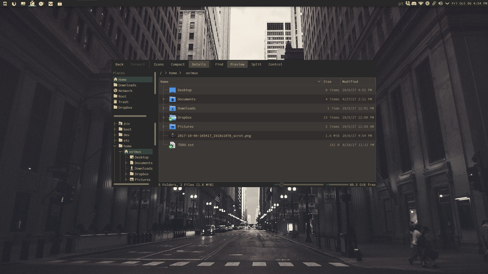

# Gruvbox Theme for Plasma Desktop

Plasma Desktop theme with Gruvbox colors



## Instalation

```
git clone https://github.com/3ximus/gruvbox-plasma
mv gruvbox-plasma/ ~/.local/share/plasma/desktoptheme/
```

## Uninstall

```
rm -rf ~/.local/share/plasma/desktoptheme/gruvbox-plasma
```

This theme was based on the Arc Theme port for KDE

## Icons

The icons I use to go with this theme are from [papirus](https://github.com/PapirusDevelopmentTeam/papirus-icon-theme) edited by me and can be found in my [dotfiles](https://github.com/3ximus/dotfiles/tree/master/icons), just replace them in your current icon theme (or duplicate your current one)

#### My [GTK](https://github.com/3ximus/gruvbox-gtk) theme to go along with this
